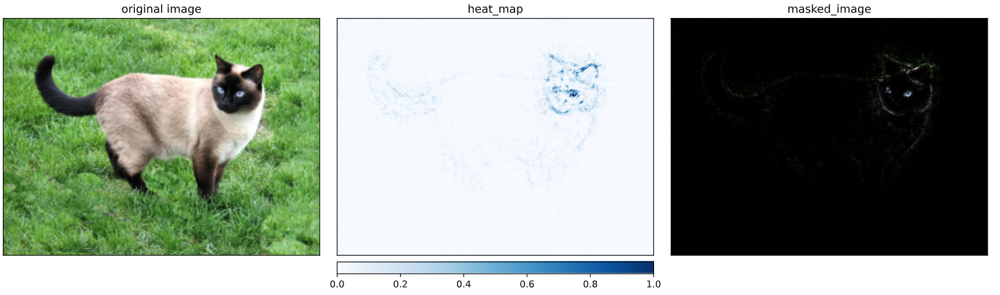
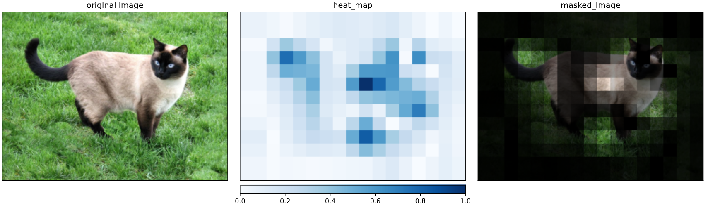

# PyData Eindhoven 2020 - Explainable AI Tutorial

In this tutorial we will take a look at pytorch based libary for XAI called
[captum](https://captum.ai/). We focus on visual methods of exploring deep neural
networks in supervised setting. Using backpropagation and perturbation based techniques
we will generate pictures like below to better understand problem of primary attribution.

